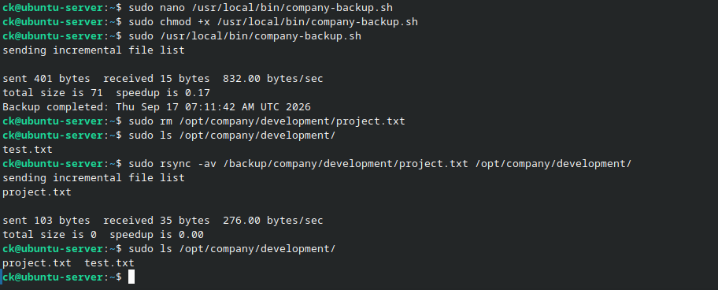

# Backup and Restore

## Objective

Implement a file backup and recovery process for company data using `rsync`.

## Backup Directory

A dedicated backup directory was created:

    sudo mkdir -p /backup/company

The company data was stored under:

    /opt/company/

The backup destination was:

    /backup/company/

## Manual Backup

A manual backup was performed using:

    sudo rsync -av /opt/company/ /backup/company/

The backup contents were then verified using:

    sudo find /backup/company -type f

## Automated Backup Script

A Bash script was created to automate the backup process.

The script uses `rsync` to synchronize the company directory with the backup location.

The script was made executable using:

    sudo chmod +x /usr/local/bin/company-backup.sh

The backup script was executed using:

    sudo /usr/local/bin/company-backup.sh

## Restore Testing

A test file was removed from the original directory to simulate data loss.

The file was restored from the backup using:

    sudo rsync -av /backup/company/development/project.txt /opt/company/development/

The restored file was then verified in the original directory.

This confirmed that the backup could be used to recover deleted data.

## Evidence

