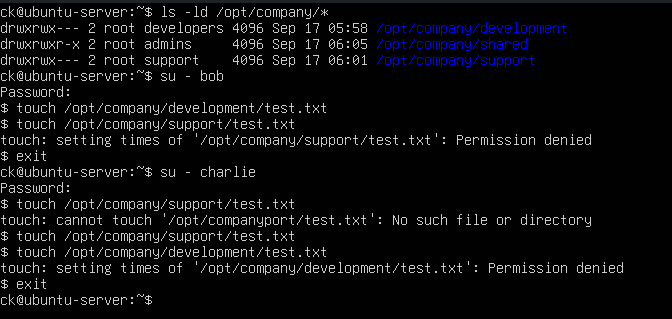

# File Permissions

## Objective

Configure Linux file ownership and permissions to control access to different company directories.

## Company Directory Structure

The following directories were created:

- `/opt/company/development`
- `/opt/company/support`
- `/opt/company/shared`

Commands used:

    sudo mkdir -p /opt/company/development
    sudo mkdir -p /opt/company/support
    sudo mkdir -p /opt/company/shared

## Ownership and Permissions

The directories were assigned to different groups:

| Directory | Group | Permissions |
|---|---|---|
| `/opt/company/development` | developers | `770` |
| `/opt/company/support` | support | `770` |
| `/opt/company/shared` | admins | `775` |

Commands used:

    sudo chown root:developers /opt/company/development
    sudo chown root:support /opt/company/support
    sudo chown root:admins /opt/company/shared

    sudo chmod 770 /opt/company/development
    sudo chmod 770 /opt/company/support
    sudo chmod 775 /opt/company/shared

## Permission Testing

Access was tested using different user accounts.

`bob`, a member of the `developers` group, was able to create files inside the development directory but was denied access to the support directory.

`charlie`, a member of the `support` group, was able to create files inside the support directory but was denied access to the development directory.

This verified that Linux group permissions were correctly restricting access.

## Verification

Permissions and ownership were verified using:

    ls -ld /opt/company/*

## Evidence

