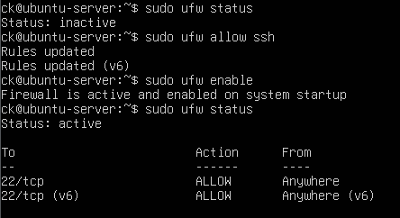

# Firewall Configuration

## Objective

Configure the Ubuntu Server firewall to control incoming network connections.

## UFW Installation and Configuration

The Uncomplicated Firewall (UFW) was configured to protect the server.

The SSH service was allowed first to prevent blocking remote administration:

    sudo ufw allow ssh

The firewall was then enabled:

    sudo ufw enable

The firewall status was verified using:

    sudo ufw status

## Web Server Access

After installing Nginx, HTTP and HTTPS traffic were allowed using the Nginx application profile:

    sudo ufw allow 'Nginx Full'

The firewall was checked again:

    sudo ufw status

This allowed remote access to the web server while keeping other incoming connections restricted.

## Verification

The firewall rules were verified using:

    sudo ufw status

The configuration confirmed that SSH and Nginx traffic were allowed.

## Evidence

