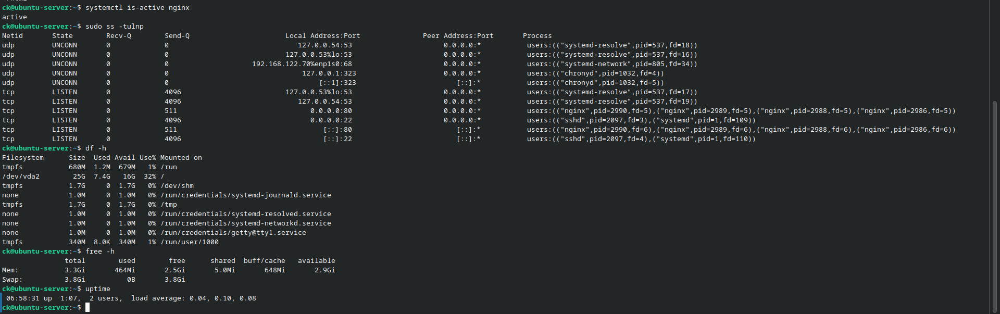

# System Monitoring

## Objective

Monitor system resources, network services, disk usage, memory usage, and system uptime on the Ubuntu Server.

## Service Monitoring

The Nginx service was checked using:

    systemctl is-active nginx

This verified whether the Nginx service was currently running.

## Network Service Monitoring

Listening network ports were checked using:

    sudo ss -tulnp

This was used to identify active network services and listening ports on the server.

## Disk Monitoring

Disk usage was checked using:

    df -h

This displayed the available and used disk space on the server's filesystems.

## Memory Monitoring

Memory usage was checked using:

    free -h

This displayed total, used, available, and free system memory.

## System Uptime

The server's uptime and load information were checked using:

    uptime

This provided information about how long the server had been running and its current system load.

## Evidence

