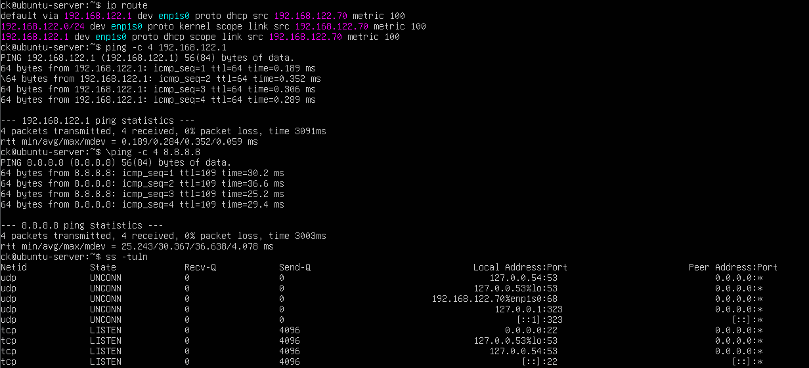

# Network Configuration

## Objective

Configure and verify network connectivity on the Ubuntu Server running in a KVM virtual machine.

## Environment

- Operating System: Ubuntu Server 26.04.1 LTS
- Virtualization: KVM
- Hostname: ubuntu-server

## Network Verification

The following commands were used to inspect the server's network configuration:

    ip addr
    ip route

`ip addr` was used to identify the server's network interface and IP address.

`ip route` was used to verify the default gateway and routing configuration.

## Connectivity Testing

Network connectivity was tested using:

    ping -c 4 <gateway>
    ping -c 4 8.8.8.8

The gateway test verified connectivity to the local network.

The external IP test verified that the server could reach the Internet.

## SSH Connectivity

The server was accessed remotely from the Fedora host using:

    ssh ck@<UBUNTU_SERVER_IP>

This confirmed that the Ubuntu server was reachable over the network.

## Evidence

