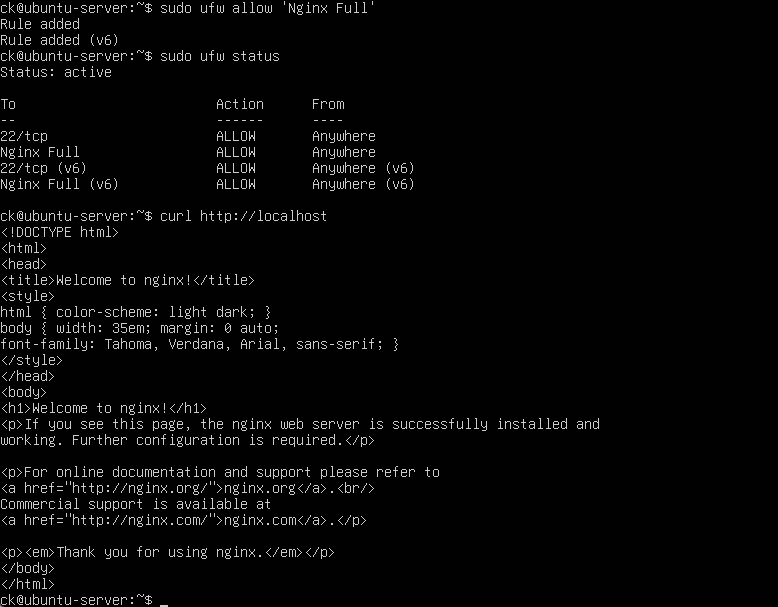
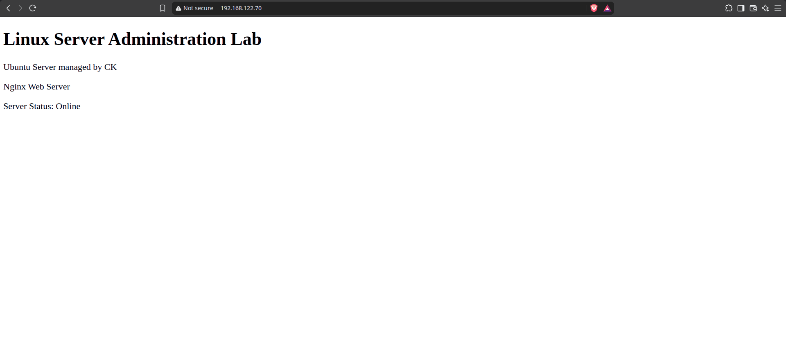

# Nginx Web Server

## Objective

Install, configure, and verify Nginx as a web server on Ubuntu Server.

## Installation

Nginx was installed using:

    sudo apt update
    sudo apt install nginx -y

The Nginx service was then checked using:

    sudo systemctl status nginx

## Firewall Configuration

Nginx traffic was allowed through the firewall using:

    sudo ufw allow 'Nginx Full'

## Web Server Testing

The Nginx server was tested locally using:

    curl http://localhost

The default Nginx page confirmed that the web server was running correctly.

The server was also accessed remotely from the Fedora host using the Ubuntu Server IP address.

## Custom Web Page

The default Nginx page was replaced with a custom webpage for this Linux Server Administration Lab.

The webpage displayed:

- Linux Server Administration Lab
- Ubuntu Server
- Nginx Web Server
- Server Status: Online

The page was verified through a web browser using the server's IP address.

## Verification

The Nginx service and web page were verified using:

    sudo systemctl status nginx
    curl http://localhost

## Evidence

