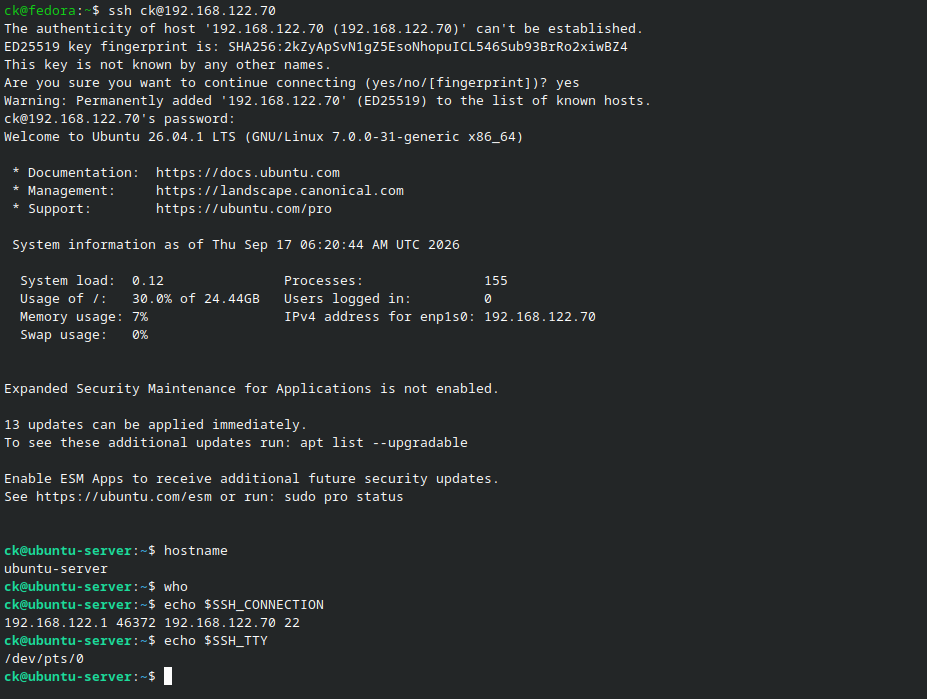
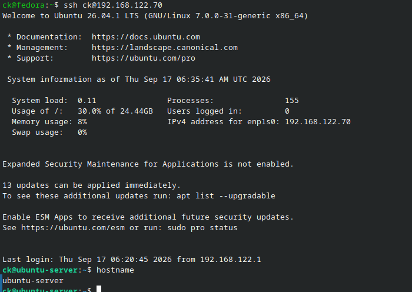

# SSH Configuration

## Objective

Configure Secure Shell (SSH) for remote administration of the Ubuntu Server.

## SSH Server Installation

The OpenSSH server package was installed using:

    sudo apt update
    sudo apt install openssh-server -y

The SSH service was verified using:

    sudo systemctl status ssh

The SSH listening port was checked using:

    sudo ss -tuln | grep :22

## Remote Administration

The Ubuntu Server was accessed remotely from the Fedora host using:

    ssh ck@<UBUNTU_SERVER_IP>

This confirmed that the server could be administered remotely through SSH.

## SSH Key Authentication

An ED25519 SSH key pair was generated on the Fedora client:

    ssh-keygen -t ed25519

The public key was copied to the Ubuntu Server using:

    ssh-copy-id ck@<UBUNTU_SERVER_IP>

The connection was then tested again:

    ssh ck@<UBUNTU_SERVER_IP>

SSH key authentication allowed the client to authenticate without entering the account password.

The private SSH key remained stored on the Fedora client and was not shared or uploaded.

## Security

Only the public SSH key was transferred to the server. The private key was kept on the client machine.

No passwords, private keys, or authentication credentials are included in this project.

## Evidence

