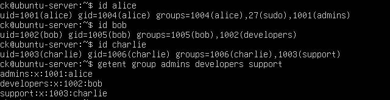

# User and Group Management

## Objective

Create and manage Linux users and groups for a small company environment.

## Groups Created

The following groups were created:

- `admins`
- `developers`
- `support`

Commands used:

    sudo groupadd admins
    sudo groupadd developers
    sudo groupadd support

## Users Created

Three users were created:

- `alice`
- `bob`
- `charlie`

Commands used:

    sudo useradd -m alice
    sudo useradd -m bob
    sudo useradd -m charlie

Passwords were configured for each user using:

    sudo passwd ****
    sudo passwd ***
    sudo passwd ******

## Group Membership

Users were assigned to groups according to their roles:

| User | Group | Role |
|---|---|---|
| alice | admins | Administrator |
| bob | developers | Developer |
| charlie | support | Support |

Alice was also added to the `sudo` group for administrative tasks.

Commands used:

    sudo usermod -aG admins alice
    sudo usermod -aG developers bob
    sudo usermod -aG support charlie
    sudo usermod -aG sudo alice

## Verification

User and group memberships were verified using:

    id alice
    id bob
    id charlie
    getent group admins developers support

## Evidence

