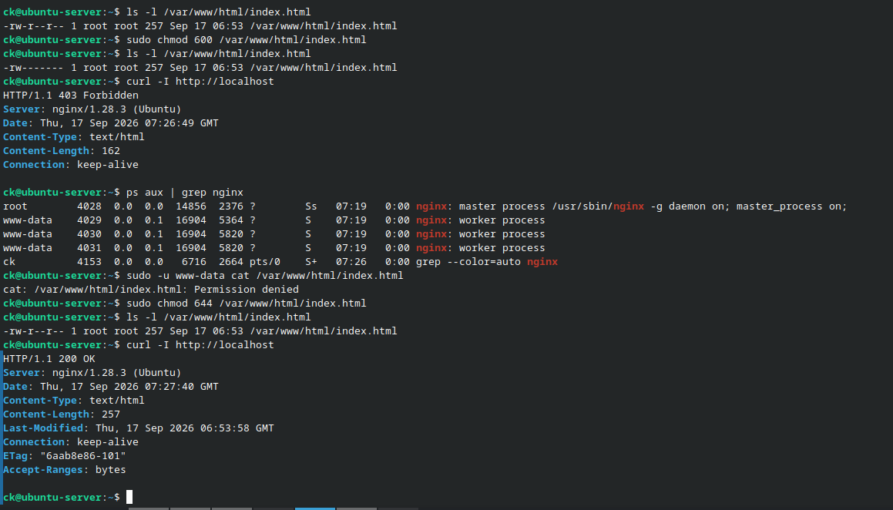

# Troubleshooting: Nginx Permission Issue

## Problem

The Nginx web server returned a `403 Forbidden` response when accessing the website.

## Investigation

The permissions of the Nginx web page were checked using:

    ls -l /var/www/html/index.html

The file permissions had been changed to:

    -rw------- 1 root root

This meant that only the root user could read the file.

The Nginx worker process runs as the `www-data` user, so its access to the file was tested using:

    sudo -u www-data cat /var/www/html/index.html

The command returned:

    Permission denied

The HTTP response was also checked using:

    curl -I http://localhost

The server returned:

    HTTP/1.1 403 Forbidden

## Cause

The `index.html` file had restrictive permissions that prevented the Nginx `www-data` user from reading it.

## Resolution

The file permissions were changed to allow the owner to read and write and other users to read:

    sudo chmod 644 /var/www/html/index.html

The file permissions were then verified:

    ls -l /var/www/html/index.html

The website was tested again:

    curl -I http://localhost

The server returned:

    HTTP/1.1 200 OK

## Result

The Nginx website became accessible again after correcting the file permissions.

This troubleshooting process demonstrated how Linux file permissions can affect web server access.

## Evidence

